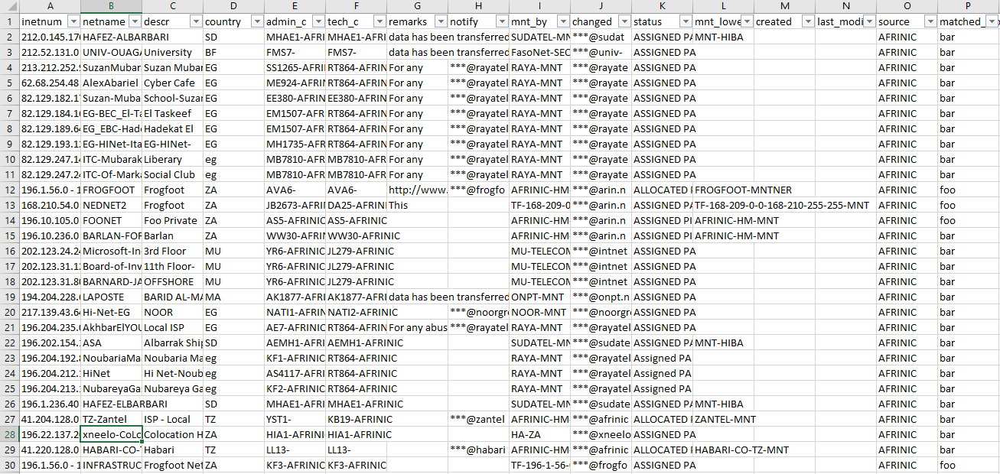

# WhoisSearch

WhoisSearch is a program that search in RIPE, APNIC and AFRINIC a list os user defined words and returns a CSV and JSON with the networks that contain at least one word of the list.

## Installation

From pypi:

```
pip3 install whoissearch
```

From repo:

```
git clone https://github.com/hackliza/WhoisSearch.git
cd WhoisSearch
pip3 install .
```

## Usage
To use this program, first, you need a list of words that you want to be searched (whitelist). 
Optionally, you can have a list of words that you want to exclude in the results (blacklist).

For example, you can have the following words in the whitelist:
```
foo
bar
example
```

and the following words in the blacklist:
```
food
bart
```

Then, you can run the program putting this words on a file or by command line as we show in the following examples:
```
whoissearch whitelist.txt -b blacklist.txt
```

```
whoissearch foo bar example -b food bart
```

```
whoissearch whitelist.txt -b food bart
```

When the program ends, you will get the following results:



```json
{
    "results": [
        {
            "inetnum": "212.0.145.176 - 212.0.145.183",
            "netname": "HAFEZ-ALBARBARI",
            "descr": "",
            "country": "SD",
            "admin_c": "MHAE1-AFRINIC",
            "tech_c": "MHAE1-AFRINIC",
            "remarks": "data has been transferred from RIPE Whois Database 20050221",
            "notify": "",
            "mnt_by": "SUDATEL-MNT",
            "changed": "***@sudatel.net 20040619\n***@afrinic.net 20050205",
            "status": "ASSIGNED PA",
            "mnt_lower": "MNT-HIBA",
            "created": "",
            "last_modified": "",
            "source": "AFRINIC",
            "matched_word": "bar"
        },
        {
            "inetnum": "212.52.131.0 - 212.52.131.255",
            "netname": "UNIV-OUAGA",
            "descr": "University of Ouagadougou\nBURKINA FASO/ousmane.barra@univ-ouaga.bf",
            "country": "BF",
            "admin_c": "FMS7-AFRINIC\nOS814-AFRINIC",
            "tech_c": "FMS7-AFRINIC\nOS814-AFRINIC",
            "remarks": "data has been transferred from RIPE Whois Database 20050221",
            "notify": "",
            "mnt_by": "FasoNet-SECURITY-MNT",
            "changed": "***@univ-ouaga.bf 19980325\n***@ripe.net 20040429\n***@afrinic.net 20050205\n***@onatel.bf 20100716\n***@onatel.bf 20161013\n***@onatel.bf 20180612",
            "status": "ASSIGNED PA",
            "mnt_lower": "",
            "created": "",
            "last_modified": "",
            "source": "AFRINIC",
            "matched_word": "bar"
        }
    ]
}
```

Databases are stored by default in folder **.whoissearch_dbs**, located at user directory. You can change this path with flag **-d**.

Results are stored by default in folder **whoissearch_results**, located at actual directory. You can change this path with flag **-o**.

For example, if you want to change directories of results and database, you can use something like:
```
whoissearch whitelist.txt -b food bart -o ./results -d ./db
```

The structure in folder where databases are stored is:
```
.
+-- AFRINIC.db.gz
+-- AFRINIC.db.txt
+-- APNIC.db.gz
+-- APNIC.db.txt
+-- RIPE.db.gz
+-- RIPE.db.txt
```

Finally, if you already have downloaded the databases, you can avoid this step by using the flag **-n**.

```
whoissearch whitelist.txt -b food bart -n
```

## Behavior
1. The program downloads the databases of RIPE, APNIC and AFRINIC from the official FTP servers.
2. Then, parses the IPv4 network blocks.
3. After that, the program classifies block in function of the words os the white and black lists.
4. Finally, write the results in CSV and JSON format.

## TODO
+ Add download, parsing and classifying of ARIN and LACNIC.
+ Search for IPv6 networks.
